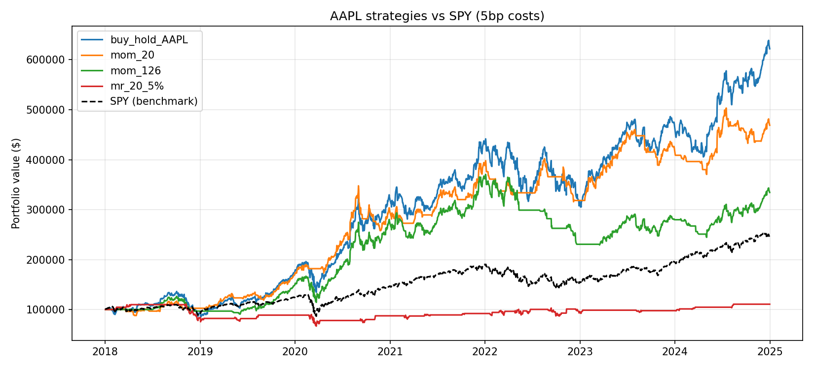
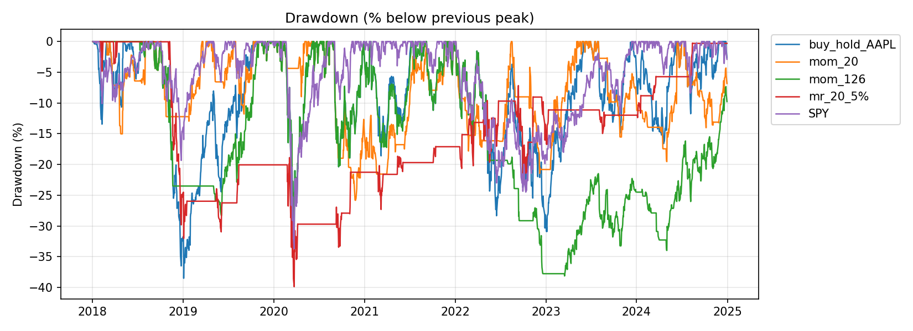

# Trading Backtester

A backtesting engine I built from scratch in Python (no backtrader/zipline) to test
a **momentum** strategy and a **mean-reversion** strategy on AAPL, 2018-2024. I built
it twice: a fast **vectorized** engine and a day-by-day **event-driven** engine, then
checked that they agree. Main takeaway: buy-and-hold AAPL had the highest return,
the 20-day momentum strategy had the best risk-adjusted result (Sharpe 1.20 vs 1.01),
and mean-reversion was the weakest overall but the only strategy to make money in the
2022 bear market. Stack: Python, pandas, numpy, matplotlib, yfinance.




## Strategies

Both strategies output a **signal**: 1 = hold the stock, 0 = hold cash.

- **Momentum (`mom_N`)**: hold when the stock's return over the last N days is
  positive, otherwise sit in cash. Idea: winners keep winning. Tested N = 20 and 126.
- **Mean-reversion (`mr_N_X%`)**: buy when the price falls X% below its N-day moving
  average, sell when it climbs back to the average. Idea: big dips snap back.
  Tested N = 20, X = 5%.
- **Buy & hold AAPL** and **SPY buy & hold** are the yardsticks.

Each strategy exists in two forms: a vectorized function (whole price series at once)
and a streaming class with `.on_bar(history)` that only sees the past. They produce
identical signals, which confirms there is no look-ahead bias.

## How the engines work

- **Vectorized** (`engine/vectorized.py`): signal -> yesterday's signal becomes today's
  position -> position x daily return -> minus costs -> equity curve.
  Shifting the signal by one day is what prevents look-ahead.
- **Event-driven** (`engine/event_driven.py`): a loop over each day. The strategy
  makes a decision, a `Portfolio` creates an `Order`, a `Broker` turns it into a
  `Fill` (charging the fee), and the portfolio updates cash and shares. It can also
  trade whole shares only.
- **Costs:** a flat 5 basis points (0.05%) of the amount traded, per buy or sell.
  Trades per year are reported next to every result so the cost assumption is concrete.
- **Metrics** (`engine/metrics.py`): Sharpe ratio, max drawdown, annualized return,
  alpha vs SPY.

## Results

*AAPL, 2018-2024, $100k start, 5 bps costs. Alpha = strategy annualized return minus
SPY's (13.7%/yr), not beta-adjusted. Risk-free rate = 0.*

| Strategy | Sharpe | Max drawdown | Ann. return | Alpha vs SPY | Trades/yr |
|---|---|---|---|---|---|
| SPY buy & hold | 0.76 | -33.7% | 13.7% | n/a | ~0 |
| AAPL buy & hold | 1.01 | -38.5% | 29.9% | 16.2% | 0.1 |
| `mom_20` | **1.20** | **-25.8%** | 24.8% | 11.1% | 20.2 |
| `mom_126` | 0.81 | -38.1% | 18.9% | 5.2% | 6.4 |
| `mr_20_5%` | 0.17 | -39.9% | 1.5% | -12.2% | 6.6 |

### Vectorized vs. event-driven

The event-driven engine was designed to reproduce the vectorized one, so any gap has to
be explained.

| Strategy | Engine | Sharpe | Max DD | Ann. return | Final equity |
|---|---|---|---|---|---|
| mom_20 | vectorized | 1.205 | -25.8% | 24.8% | $468,906 |
| | event (fractional) | 1.203 | -25.9% | 24.8% | $468,873 |
| | event (whole shares) | 1.203 | -25.9% | 24.8% | $468,776 |
| mom_126 | vectorized | 0.805 | -38.1% | 18.9% | $334,375 |
| | event (fractional) | 0.805 | -38.1% | 18.9% | $334,389 |
| | event (whole shares) | 0.805 | -38.1% | 18.9% | $334,331 |
| mr_20_5% | vectorized | 0.172 | -39.9% | 1.5% | $110,672 |
| | event (fractional) | 0.172 | -39.9% | 1.5% | $110,669 |
| | event (whole shares) | 0.172 | -39.9% | 1.5% | $110,656 |

Full table (including buy & hold): `results/engine_comparison.csv`.

- **Zero costs:** final equity matches to the cent (differences ~1e-15, floating-point noise).
- **5 bps costs:** final equity differs by under 0.01%. The cause is fee timing: the
  event engine charges the fee on the day of the trade, the vectorized one the day after.
- **Whole shares:** costs only 0.01-0.03% at $100k, but about 0.5% for momentum at
  $5k, where one share is a big slice of the account.
- **Takeaway:** engine differences (under 0.01%) are tiny next to strategy differences
  (mom_20 ends near $469k vs $334k for mom_126), so the conclusions don't depend on
  which engine produced them.

## Key findings

- **Buy-and-hold AAPL beat every strategy on return** (29.9%/yr vs 24.8% for mom_20).
  mom_20 had the best Sharpe (1.20 vs 1.01) and a shallower worst drawdown (-26% vs
  -39%), so it gave a smoother ride, not a higher return. The price: about 20 trades
  a year.
- **Mean-reversion was mostly in cash but still had a -39.9% drawdown**, as deep as
  buy-and-hold's. It bottomed on 2020-03-23, the COVID crash low: the strategy kept
  buying a falling stock because it looked "cheap" versus its average.
- **Regime comparison.** I ran each strategy once over 2018-2024, then sliced the
  daily returns into two windows and rebuilt a fresh $100k equity curve for each
  (so the lookback windows were already warmed up). Details in
  `results/regime_comparison.csv`.

| Annualized return / max DD | 2022 bear | 2023-24 bull |
|---|---|---|
| SPY | -18.2% | +25.9% |
| AAPL buy & hold | -26.4% / -30.3% | +40.2% / -16.6% |
| mom_20 | -18.0% / -21.5% | +21.5% / -19.5% |
| mom_126 | -36.2% / -37.8% | +20.5% / -15.9% |
| mr_20_5% | **+4.4% / -15.4%** | +7.4% / -4.4% |

  In the 2022 bear market, mean-reversion was the only strategy that made money, while
  buy-and-hold AAPL fell 26% and SPY fell 18%. Momentum was mixed: the 20-day version
  roughly matched SPY, but the 126-day version lost 36%, whipsawed by bear-market
  rallies. In the 2023-24 bull run the ranking flipped: AAPL returned 40%/yr, SPY 26%/yr,
  both momentum versions about 21%/yr, and mean-reversion only 7.4%/yr, because it held
  a position just ~10% of days. Trading frequency also moved with the market: mom_20
  made about 29 trades in 2022 versus about 24 per year in the bull run, so choppy
  markets cost more in fees.

## Limitations

- **One stock, one period.** Everything is AAPL, 2018-2024. AAPL was a huge winner, so
  alpha vs SPY is inflated; compare against AAPL buy & hold too.
- **Light parameter testing.** I tried a handful of lookbacks and picked mom_20 as the
  headline, so it is mildly overfit. Don't read its Sharpe of 1.2 as a forecast.
- **Alpha is simple subtraction** (strategy return minus SPY return), not
  beta-adjusted, and the risk-free rate is 0.
- **Same-close fills.** Both engines trade at the close of the day the signal fires.
  Slightly optimistic; next-day-open fills would be more conservative.
- **Simple costs.** A flat 5 bps, no bid-ask spread or market impact.
- **Each regime is one episode.** 2022 and 2023-24 illustrate regime dependence, they
  don't prove it. Sharpe over ~250 days is noisy, so I lean on return and drawdown there.

## How to run

```bash
git clone https://github.com/TjWill859/trading-backtester.git
cd trading-backtester
python -m venv venv && source venv/bin/activate   # or use conda
pip install -r requirements.txt

python run_all.py                  # regenerates all charts and tables in results/
python data/fetch_data.py          # optional: re-download price data from Yahoo Finance
jupyter lab sanity_check.ipynb     # optional: the step-by-step scratch notebook
```

Price data for AAPL, MSFT, JPM, XOM and SPY (2018-2024) is already included in
`data/raw/`, so `run_all.py` works offline. Re-downloading may give slightly different
numbers if Yahoo revises its adjusted prices.

## Project structure

```
data/         fetch_data.py (download), load_data.py (read CSVs), raw/ (price data)
strategies/   momentum.py, mean_reversion.py  (vectorized signal + streaming class)
engine/       vectorized.py, event_driven.py, metrics.py, plots.py
results/      charts and CSV tables
run_all.py    reproduces everything in results/
sanity_check.ipynb   scratch notebook used while building
```
